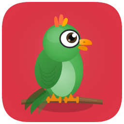

<p align="center">
  
</p>

<h1 align="center">Clippy</h1>

<p align="center">
  <strong>Your little coding buddy that lives on your screen.</strong>
</p>

<p align="center">
  
  
  
  
  
</p>

<p align="center">
  
</p>

---

Clippy is a desktop pet that sits on top of your screen while you work. It watches your cursor, reacts to your typing, gets excited when you scroll, and falls asleep if you walk away. It's basically a tiny friend that hangs out with you while you code.

Pick from 20 hand-drawn characters — each with their own personality and things to say. Right-click for a Pomodoro timer, stretch reminders, or to pin a note. If you use AI coding tools, Clippy notices when they're thinking and does a little celebration dance when they finish.

It's the kind of thing that makes you smile at 2am when you're deep in a debugging session.

---

## What It Does

**It follows your cursor.** Clippy's eyes track your mouse everywhere on screen. Move slowly and it watches curiously. Move fast and it chases you across the desktop.

**It reacts to your typing.** Type normally and it bobs along. Type fast for a while and it overheats — turns red, starts shaking, little steam particles float up. It's dramatic.

**It gets bored.** Leave your computer for a couple minutes and it starts looking around. A little longer and it yawns. Five minutes and it's asleep with little Z's floating up.

**It likes being pet.** Hover your cursor slowly over its head and after a second it lights up with a happy face and floating hearts.

**It bounces.** Drag it anywhere on screen and drop it — it bounces with a satisfying spring physics wobble.

**It talks to you.** Speech bubbles pop up with context-aware messages. Each character has its own voice — the Rubber Duck asks Socratic questions, the Cat is aloof, the Coffee Cup is way too caffeinated.

**It knows when your AI is working.** If you're using Claude Code, Cursor, Codex, or Kiro, Clippy enters a "thinking" animation while it runs. When the AI finishes, Clippy celebrates with sparkles and a victory dance. There's even an optional Mario coin sound.

**It helps you stay healthy.** Built-in Pomodoro timer. Stretch reminders every 45 minutes that go full-screen so you actually stand up. Pinned notes. Scheduled reminders.

**It stays out of your way.** The window is transparent and click-through — you can click right through it to your IDE. It only becomes interactive when your cursor is directly over the character or an open menu.

---

## Meet the Characters

20 characters, each fully hand-drawn with procedural Canvas rendering. Every one has unique animations, colors, and a personality that comes through in what they say.

| | Character | Vibe |
|---|---|---|
| | **Clippy** | The original. Helpful, a little sarcastic, always has a tip. |
| | **Clippy Gold** | The fancy one. Encouraging and refined. |
| | **Clippy Dark** | Carbon fiber. Mysterious. Speaks in short sentences. |
| | **Clippy Neon** | Glowing cyan and magenta. Can't sit still. |
| | **Parrot** | Chatty, colorful, repeats things back at you (in a good way). |
| | **Robot** | Chrome and LEDs. Efficient. Slightly confused by emotions. |
| | **Fox** | Clever and warm. Gives the best advice. |
| | **Rubber Duck** | The debugger's best friend. Asks you questions until you figure it out. |
| | **Dog** | Golden retriever energy. Thinks everything you do is amazing. |
| | **Owl** | Wise. Contemplative. Quotes things. |
| | **Cat** | Could not care less about your code. Might help. Might not. |
| | **UFO** | Visiting from somewhere else. Fascinated by human coding rituals. |
| | **Octopus** | Eight arms, multitasking jokes, surprisingly good at pair programming. |
| | **Cactus** | Dry humor. Low maintenance. Thrives on neglect. |
| | **Coffee Cup** | VERY awake. Types in ALL CAPS sometimes. Vibrating slightly. |
| | **Dice** | Random. Unpredictable. Rolls with it. |
| | **Penguin** | Formal. Tuxedo. Surprisingly chill about deadlines. |
| | **Mushroom** | Whimsical. Nature-oriented. Probably knows something you don't. |
| | **Lightbulb** | Always having ideas. Literally glows when you type something good. |
| | **Ghost** | Spooky but friendly. Haunts your codebase with gentle suggestions. |

---

## Behaviors

Clippy has 14 distinct animation states, each triggered by what you're doing:

| What's happening | What Clippy does |
|---|---|
| You're just sitting there | Breathes softly, looks around occasionally |
| You move your cursor | Eyes follow it everywhere |
| You're typing | Bobs along with your keystrokes |
| You're typing *really* fast | Overheats — turns red, shakes, steam particles |
| You're scrolling | Does an unrolling animation |
| You fling your cursor fast | Chases it across the screen |
| You drag it somewhere | Follows your cursor, wobbles on release |
| You hover on its head slowly | Gets happy, floating hearts |
| Your AI tool is running | Thinking animation with thought bubbles |
| Your AI tool finishes | Victory dance with sparkles |
| 45 minutes of work | Reminds you to stretch (full-screen overlay) |
| You get a reminder | Waves to get your attention |
| You say hi | Waves back |
| You leave for 5 minutes | Falls asleep with little Z's |

---

## Getting Started

### What You Need

- macOS 11.0+
- Node.js 18+
- Rust ([rustup.rs](https://rustup.rs))
- Xcode Command Line Tools (`xcode-select --install`)

### Run It

```bash
git clone https://github.com/buildingjoshbetter/Clippy.git
cd Clippy
npm install
npm run tauri dev
```

macOS will ask for Accessibility permissions on first launch — Clippy needs this to see your keyboard and cursor activity. Grant it in System Settings > Privacy & Security > Accessibility.

### Build the App

```bash
npm run tauri build
```

This gives you `Clippy.app` and a `.dmg` installer.

---

## Optional: Coin Sound for Claude Code

If you use Claude Code, you can set up a Mario coin sound that plays every time Claude finishes a response.

1. Copy `coin.wav` to `~/.desktop-clippy/coin.wav`
2. Add a Stop hook to `~/.claude/settings.json`:

```json
{
  "hooks": {
    "Stop": [
      {
        "matcher": "",
        "hooks": ["~/.desktop-clippy/play-coin.sh"]
      }
    ]
  }
}
```

It only plays for interactive terminal sessions — background processes won't trigger it.

---

## How It's Built

Under the hood, Clippy is a Tauri 2 app with a React frontend and a Rust backend. The character lives in a transparent, always-on-top window that covers your entire screen but lets clicks pass through to your IDE.

The tricky part was making it clickable without blocking everything underneath. A Rust thread polls the cursor position every 16ms and checks if it's over the character or any open menu. If yes, clicks work. If no, they pass right through. When a modal opens (settings, stretch overlay), the whole window becomes interactive until it closes.

Input monitoring uses macOS CGEventTap for global keyboard and scroll events on a background thread. The frontend polls this at 30fps and derives behavioral triggers — typing speed, cursor velocity, scroll activity, idle duration.

Each character is 400-750 lines of procedural Canvas drawing code — bezier curves, gradients, and custom animations. No sprites or images. Particles (hearts, steam, sparkles, Z's) are handled by a lightweight particle system.

| | |
|---|---|
| **Framework** | Tauri 2 + React 19 + Zustand 5 |
| **Rendering** | HTML5 Canvas at 30fps |
| **Languages** | TypeScript + Rust |
| **Input** | CGEventTap (Core Graphics) |
| **Window** | Cocoa AppKit (transparency + click-through) |
| **Sound** | Web Audio API + afplay |
| **Build** | Vite 8 + Cargo |

---

## Project Structure

<details>
<summary>Full file tree</summary>

```
src/
├── App.tsx                          Main app component
├── store.ts                         Zustand state management
├── main.tsx                         Entry point
│
├── components/
│   ├── ClippyCanvas.tsx             Canvas render loop (30fps)
│   ├── SpeechBubble.tsx             Floating dialogue bubbles
│   ├── ContextMenu.tsx              Right-click menu
│   ├── SettingsPanel.tsx            Character picker + settings
│   ├── PomodoroWidget.tsx           Focus/break timer
│   ├── ReminderToast.tsx            Notification popups
│   ├── FixedNote.tsx                Pinned note display
│   └── StretchOverlay.tsx           Full-screen stretch reminder
│
├── hooks/
│   ├── useClippy.ts                 Animation state machine
│   ├── useInput.ts                  Cursor/keyboard/scroll polling
│   ├── useInteractiveRegions.ts     Click-through region management
│   ├── useAIStatus.ts               AI tool detection
│   ├── useConfig.ts                 Settings persistence
│   └── useTimers.ts                 Pomodoro + stretch timers
│
├── engine/
│   ├── ClippyRenderer.ts            Legacy paperclip renderer
│   ├── ParticleSystem.ts            Hearts, steam, sparkles, Z's
│   └── characters/                  20 character renderers
│       ├── clippy.ts                Classic silver paperclip
│       ├── parrot.ts                Green parrot
│       ├── robot.ts, fox.ts, ...    16 more characters
│       └── ghost.ts                 Translucent ghost
│
├── systems/
│   ├── SoundSystem.ts               Web Audio synthesis
│   ├── IdleBehavior.ts              Progressive idle states
│   └── AIStatusSystem.ts            AI status polling
│
└── config/
    ├── defaults.ts                  Default configuration
    └── speechLines.ts               230 lines of dialogue

src-tauri/src/
├── lib.rs                           App setup + system tray
├── commands.rs                      Tauri IPC commands
├── input/
│   ├── keyboard.rs                  CGEventTap (keys + scroll)
│   └── mouse.rs                     Cursor polling + hit-test
└── process/
    └── watcher.rs                   AI tool detection
```

</details>

---

## Configuration

Right-click the character to open Settings, or edit `~/.desktop-clippy/config.json` directly:

```json
{
  "characterVariant": "parrot",
  "characterScale": 3,
  "coinVolume": 10,
  "stretchInterval": 45,
  "pomodoroFocus": 25,
  "pomodoroBreak": 5
}
```

---

## License

MIT

---

<p align="center">
  Built by <a href="https://github.com/buildingjoshbetter">@building_josh</a>
</p>
